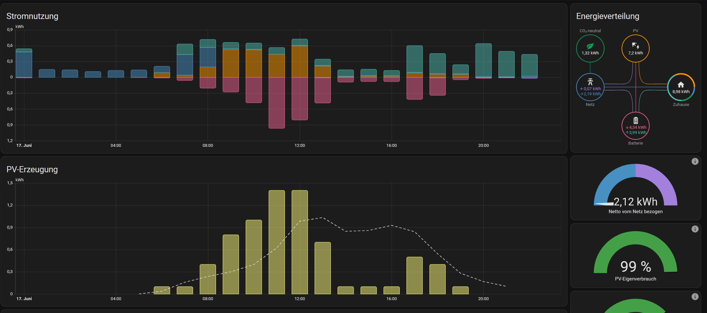

= LeoGreen 🌿
:revnumber: 1.0
:revdate: {docdate}
:revremark: SLIDEDEMO @ HTL Leonding
:encoding: utf-8
:lang: de
:doctype: article
:backend: revealjs
:customcss: css/presentation.css
:revealjs_width: 1408
:revealjs_height: 792
:source-highlighter: highlightjs
:highlightjs-theme: css/atom-one-light.css
:iconfont-remote!:
:iconfont-name: fonts/fontawesome/css/all
:title-slide-transition: zoom
:title-slide-transition-speed: fast
:imagesdir: images

//------------------------------
// TITLE SLIDE
//------------------------------
[.center, .title-slide]
== LeoGreen 🌿

[.footer]
Version 1.0 — HTL Leonding — 2025

//------------------------------
// ÜBERNAHME DES PROJEKTS
//------------------------------
[.lightbg]
== Projektübernahme

[.card]
* Ursprünglich von einem früheren Team gestartet
* Wir haben das Projekt übernommen

image::images/project_handover.jpg[width=600,align=center]

//------------------------------
// TEAM
//------------------------------
[.lightbg, .center]
== Unser Team

[.team-list]
* Daniel Lettner
* Elias Pointinger
* Stefan Schachner
* Paul Kreinecker
* Jonas Leitner

image::images/team.jpg[width=500,align=center]

//------------------------------
// PV-ANLAGEN
//------------------------------
[.center]
== Photovoltaik (PV)

[.card]
* Über **190 PV-Module** auf dem Schuldach
* Erzeugen **grünen Strom** für die Schule
* Bisher: Daten nur in Rohform verfügbar
* **Unser Ziel**: Echtzeit-Dashboard mit Ertrag, Einspeisung, CO₂-Einsparung

image::images/pv_anlage.png[width=700,align=center]

//------------------------------
// DASHBOARD
//------------------------------
[.lightbg]
== Das LeoGreen-Dashboard

[.card]
* Zentrale Plattform zur **Visualisierung aller Messdaten**
* **Zwei Hauptbereiche**:
  **1.** PV-Ertragsdaten
  **2.** Raumklima (Temperatur, Sauerstoff/CO₂)
* Basierend auf **Grafana + InfluxDB + MQTT**

//------------------------------
// KLASSENRAUM
//------------------------------
[.lightbg]
== Klassenraum – Warum messen?

[.card]
* Bis zu **30 Schüler:innen** in einem Raum
* Bei geschlossenen Fenstern: **CO₂-Werte > 2000 ppm** möglich
* **Folgen**: Müdigkeit, Konzentrationsschwäche
* **Lösung**: Automatische Überwachung + Warnsystem

//------------------------------
// SENSOREN
//------------------------------
[.center]
== Unsere Sensoren

image::images/sensor_setup.jpg[width=500,align=center]

//------------------------------
// TECHNOLOGIESTACK
//------------------------------
[.center]
== Technologien

[.card]
* **Grafana** – Visualisierung
* **InfluxDB** – Zeitreihendatenbank
* **MQTT** – Echtzeit-Datenübertragung
* **Telegraf** – Daten sammeln

image::images/tech_stack.jpg[width=600,align=center]

//------------------------------
// END SLIDE
//------------------------------
[.center, .lightbg]
== Danke für Ihre Aufmerksamkeit 🌱