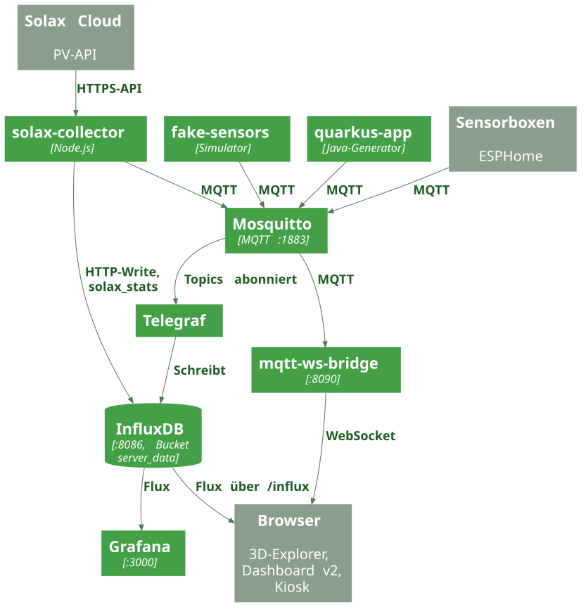

LeoIoT sammelt Raumklimadaten (Temperatur, CO₂) sowie Photovoltaik-Daten (Solax) und zeigt sie in mehreren Oberflächen an. Alle Dienste werden über `docker-compose.yaml` gestartet und laufen als Docker-Container (abgeschottete Programmpakete) im gemeinsamen Netzwerk `leoiot`. Kurz zu den Begriffen: Solax ist der Hersteller des PV-Wechselrichters, ein Kiosk ist eine Vollbild-Anzeige ohne Bedienung.

## Pipeline im Überblick

1. **Quellen** senden Messwerte per MQTT an Mosquitto, den MQTT-Vermittler (Broker): die echten Sensorboxen (programmiert mit ESPHome), der Simulator `fake-sensors`, der Java-Generator `quarkus-app` und der `solax-collector` (PV-Daten).
2. **Telegraf** (ein Übertragungswerkzeug) hört bei Mosquitto auf bestimmte Themen (Topics) und speichert die Werte im InfluxDB-Bereich (Bucket) `server_data`.
3. Der `solax-collector` schreibt die PV-Kennzahlen zusätzlich direkt per HTTP in InfluxDB (Measurement `solax_stats`).
4. **Grafana** und die Web-Frontends lesen die Verlaufsdaten aus InfluxDB (mit Flux, der Abfragesprache von InfluxDB).
5. **Live-Weg:** Die `mqtt-ws-bridge` (eine Brücke zwischen MQTT und dem Browser) empfängt dieselben Messwerte von Mosquitto und schickt sie über einen WebSocket (eine dauerhaft offene Verbindung zum Browser) sofort weiter. Die PV-Live-Daten kommen zusätzlich von einem externen PV-Broker (siehe `mqtt-ws-bridge` unter „Rolle der Komponenten“).

:::note[Öffentliche Pfade]
Ein Reverse-Proxy (Nginx; ein Verteiler, der Anfragen an den richtigen Dienst leitet) macht alle Oberflächen unter einer gemeinsamen Domain erreichbar (Konfiguration: `deploy/nginx.conf`). Die Pfade stehen im Abschnitt [Nginx-Routing](../operations/#nginx-routing) der Seite Betrieb.
:::

## Dienste

Ports laut `docker-compose.yaml` (nach außen veröffentlichte Ports).

| Dienst | Port | Zweck |
|---|---|---|
| `mosquitto` | 1883 | MQTT-Broker (Eclipse Mosquitto), Zugriff nur mit Login (`allow_anonymous false`) |
| `influxdb` | 8086 | Zeitreihendatenbank InfluxDB 2.7, Organisation `leoiot`, Bucket `server_data` |
| `telegraf` | – | Überträgt MQTT-Nachrichten nach InfluxDB (kein veröffentlichter Port) |
| `grafana` | 3000 | Dashboards, Datenquelle und Dashboard werden aus `grafana/` provisioniert |
| `frontend` | 8080 | 3D-Explorer (Vite-Dev-Server) |
| `dashboard-v2` | 8081 | Dashboard v2 (Vite-Dev-Server) |
| `kiosk` | 8082 | Kiosk-Variante (PV-Anzeige) |
| `kiosk2` | 8083 | Kiosk-Variante (PV-Anzeige) |
| `kiosk3` | 8084 | Kiosk-Variante (PV-Anzeige) |
| `kiosk4` | 8085 | Kiosk-Variante (PV-Anzeige) |
| `leogreen-kiosk` | 8087 | LeoGreen-Kiosk (PV-Anzeige mit Live-Daten über die Bridge) |
| `mqtt-ws-bridge` | 8090 | Brücke zwischen MQTT und Browser (WebSocket-Server); gibt Live-Messwerte weiter |
| `fake-sensors` | – | Simulator für Raumtemperatur und CO₂ |
| `quarkus-app` | – | Java-Generator (Quarkus), veröffentlicht per MQTT |
| `solax-collector` | – | Holt PV-Daten aus der Solax-Cloud, schreibt nach InfluxDB und MQTT |

## Rolle der Komponenten

- **Mosquitto**: der zentrale MQTT-Broker, also die Vermittlungsstelle: Sensoren senden Nachrichten hin, andere Dienste holen sie ab. `config/mosquitto.conf` nimmt Verbindungen auf Port 1883 aus dem ganzen Netz an und verbietet anonyme Verbindungen.
- **Telegraf**: zwei MQTT-Consumer in `telegraf.conf`. Der erste liest die Topics `nili3/#`, `nili3_co2/#`, `homeassistant/#`, `esphome/#` als Zahlenwert (`data_format = "value"`, Typ `float`). Der zweite liest `room-temperature` als JSON und legt den Wert unter dem Measurement `room_temperature` mit dem Tag `room` ab. Ausgabe: InfluxDB-Bucket `server_data`.
- **InfluxDB**: speichert alle Messwerte. Beim Start wird die Organisation `leoiot` und der Bucket `server_data` angelegt (`DOCKER_INFLUXDB_INIT_*`).
- **Grafana**: Datenquelle `InfluxDB-Flux` (Flux, Standard-Bucket `server_data`) und das Dashboard `grafana/dashboards/main-dashboard.json` werden beim Start geladen.
- **mqtt-ws-bridge** (`mqtt-ws-bridge/index.js`): verbindet sich mit Mosquitto, hält pro Raum den letzten Temperatur- und CO₂-Wert und schickt Änderungen an Browser, die den jeweiligen Raum abonniert haben. PV-Daten gehen an alle verbundenen Clients. Zusätzlich verbindet sich die Bridge per TLS mit einem externen PV-Broker (Host, Port, Benutzer und Passwort über `PV_MQTT_*`).
- **solax-collector** (`solax-collector/index.js`): fragt jede Minute die Solax-Cloud ab, schreibt die Kennzahlen als Measurement `solax_stats` in InfluxDB und veröffentlicht den Rohdatensatz auf dem Topic `leoenergy/solax_pv/overall_inverter` (retained, d. h. der Broker merkt sich den letzten Wert für neue Empfänger). Daneben existiert `solax-collector/backfill.js`, der in `docker-compose.yaml` nicht gestartet wird.
- **fake-sensors** (`fake-sensors/index.js`): simuliert 117 Räume (Konfiguration `roomsConfig`) mit Tagesgang und Belegung und veröffentlicht standardmäßig alle 10 Sekunden (`UPDATE_INTERVAL`).
- **quarkus-app** (`backend/sensor-data-generator`): Quarkus-Anwendung, deren `application.properties` die MQTT-Kanäle `sine` und `room-temperature` auf Mosquitto konfiguriert.
- **Frontends**: siehe nächster Abschnitt.

## Frontends und ihr Status

| Frontend | Verzeichnis | Datenquellen im Code |
|---|---|---|
| 3D-Explorer | `frontend/` (`logic.js`) | Three.js-Gebäudemodell; Raumwerte aus InfluxDB (`room_temperature`, `mqtt_consumer`) und live per WebSocket |
| Dashboard v2 | `dashboard-v2/` (`dashboard.js`) | InfluxDB über `/influx`, Live-Werte per WebSocket `/ws`, PV-Daten (Measurement `solax_stats` und direkter Abruf der Solax-Cloud über `/solax/`), Chart.js-Diagramme, Sprachumschaltung DE/EN |
| LeoGreen-Kiosk | `leogreenKiosk/` (`kiosk.js`) | PV-Anzeige: Measurement `solax_stats` aus InfluxDB plus Live-PV per WebSocket |
| Kiosk-Varianten | `kiosk/`, `kiosk2/`, `kiosk3/`, `kiosk4/` | PV-Anzeige (`solax_stats`); nur `kiosk/` nutzt zusätzlich den WebSocket |

Der 3D-Explorer (`frontend`) und das Dashboard v2 zeigen das Raumklima. Das Dashboard v2 enthält zusätzlich die PV-Ansicht und eine Raumtabelle mit Status. Produktiv gezeigt wird der LeoGreen-Kiosk (er hängt in `docker-compose.yaml` von der Bridge ab); `kiosk` bis `kiosk4` sind weitere Varianten (Kiosk = Vollbild-Anzeige ohne Bedienung).

:::note[Betrieb]
Die Frontends laufen als Vite-Dev-Server (`npm run dev`) in `node:20-alpine`-Containern. Deployment und weitere Einschränkungen stehen auf der Seite [Betrieb](../operations/).
:::

:::caution[Sicherheit]
Im Repository stehen an mehreren Stellen Zugangsdaten und ein InfluxDB-Token als Standardwerte im Quellcode (zum Beispiel in `docker-compose.yaml`, `mqtt-ws-bridge/index.js`, `solax-collector/index.js` und in den Frontends). Diese Werte werden hier bewusst nicht wiedergegeben; sie sollten aus dem Quellcode entfernt (z. B. in Umgebungsvariablen oder geheime Speicher) und durch neue Werte ersetzt werden. Weitere Hinweise: Seite [Betrieb](../operations/#bekannte-einschränkungen).
:::

## Quellen im Repository

- `docker-compose.yaml`
- `telegraf.conf`
- `config/mosquitto.conf`
- `mqtt-ws-bridge/index.js`
- `solax-collector/index.js`
- `fake-sensors/index.js`
- `backend/sensor-data-generator/src/main/resources/application.properties`
- `grafana/provisioning/`, `grafana/dashboards/main-dashboard.json`
- `deploy/nginx.conf`
- `frontend/logic.js`, `dashboard-v2/dashboard.js`, `leogreenKiosk/kiosk.js`, `kiosk/kiosk.js`, `kiosk2/kiosk2.js`, `kiosk3/kiosk3.js`, `kiosk4/kiosk4.js`
