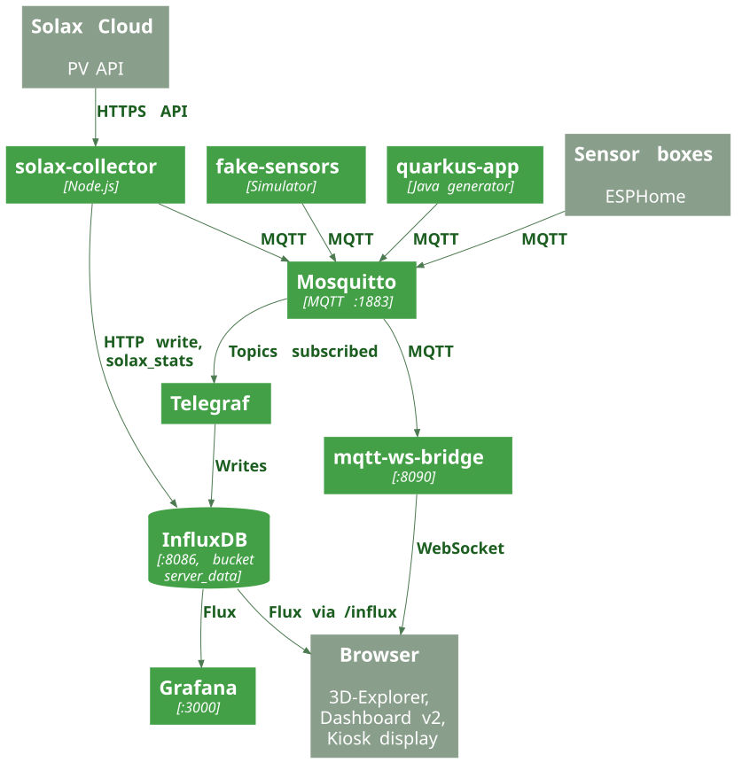

LeoIoT collects room climate data (temperature, CO₂) and photovoltaic data (Solax) and shows them in several user interfaces. All services are started via `docker-compose.yaml` and run as Docker containers (self-contained program packages) in the shared network `leoiot`. Two terms in brief: Solax is the manufacturer of the PV inverter, and a kiosk is a full-screen display without interaction.

## Pipeline overview

1. **Sources** send measurements via MQTT to Mosquitto, the message broker: the real sensor boxes (programmed with ESPHome), the `fake-sensors` simulator, the Java generator `quarkus-app` and the `solax-collector` (PV data).
2. **Telegraf** (a data-transfer tool) listens to certain topics on Mosquitto and stores the values in the InfluxDB bucket `server_data` (a bucket is a storage area).
3. The `solax-collector` additionally writes the PV figures directly into InfluxDB over HTTP (measurement `solax_stats`).
4. **Grafana** and the web frontends read history from InfluxDB (using Flux, InfluxDB’s query language).
5. **Live path:** the `mqtt-ws-bridge` (a bridge between MQTT and the browser) receives the same measurements from Mosquitto and forwards them at once over a WebSocket (a connection that stays open to the browser). Live PV data additionally comes from an external PV broker (see `mqtt-ws-bridge` under “Role of the components”).

:::note[Public paths]
A reverse proxy (Nginx; a router that sends each request to the right service) makes all interfaces reachable under one domain (configuration: `deploy/nginx.conf`). The paths are listed in the section [Nginx routing](../operations/#nginx-routing) of the Operations page.
:::

## Services

Ports as published in `docker-compose.yaml`.

| Service | Port | Purpose |
|---|---|---|
| `mosquitto` | 1883 | MQTT broker (Eclipse Mosquitto), login required (`allow_anonymous false`) |
| `influxdb` | 8086 | Time-series database InfluxDB 2.7, organisation `leoiot`, bucket `server_data` |
| `telegraf` | – | Moves MQTT messages into InfluxDB (no published port) |
| `grafana` | 3000 | Dashboards; data source and dashboard are provisioned from `grafana/` |
| `frontend` | 8080 | 3D explorer (Vite dev server) |
| `dashboard-v2` | 8081 | Dashboard v2 (Vite dev server) |
| `kiosk` | 8082 | Kiosk variant (PV display) |
| `kiosk2` | 8083 | Kiosk variant (PV display) |
| `kiosk3` | 8084 | Kiosk variant (PV display) |
| `kiosk4` | 8085 | Kiosk variant (PV display) |
| `leogreen-kiosk` | 8087 | LeoGreen kiosk (PV display with live data via the bridge) |
| `mqtt-ws-bridge` | 8090 | Bridge between MQTT and browser (WebSocket server); passes on live readings |
| `fake-sensors` | – | Simulator for room temperature and CO₂ |
| `quarkus-app` | – | Java generator (Quarkus), publishes via MQTT |
| `solax-collector` | – | Fetches PV data from the Solax cloud, writes to InfluxDB and MQTT |

## Role of the components

- **Mosquitto**: the central MQTT broker, i.e. the switchboard: sensors send messages to it, other services pick them up. `config/mosquitto.conf` accepts connections on port 1883 from the whole network and forbids anonymous connections.
- **Telegraf**: two MQTT consumers in `telegraf.conf`. The first reads topics `nili3/#`, `nili3_co2/#`, `homeassistant/#`, `esphome/#` as a number (`data_format = "value"`, type `float`). The second reads `room-temperature` as JSON and stores the value under measurement `room_temperature` with tag `room`. Output: InfluxDB bucket `server_data`.
- **InfluxDB**: stores all measurements. Organisation `leoiot` and bucket `server_data` are created at first start (`DOCKER_INFLUXDB_INIT_*`).
- **Grafana**: the data source `InfluxDB-Flux` (Flux, default bucket `server_data`) and the dashboard `grafana/dashboards/main-dashboard.json` are loaded at start.
- **mqtt-ws-bridge** (`mqtt-ws-bridge/index.js`): connects to Mosquitto, keeps the latest temperature and CO₂ value per room and pushes changes to browsers that subscribed to that room. PV data goes to all connected clients. The bridge also connects over TLS to an external PV broker (host, port, user and password via `PV_MQTT_*`).
- **solax-collector** (`solax-collector/index.js`): polls the Solax cloud every minute, writes the figures as measurement `solax_stats` into InfluxDB and publishes the raw record to the topic `leoenergy/solax_pv/overall_inverter` (retained, i.e. the broker remembers the last value for new subscribers). `solax-collector/backfill.js` also exists but is not started in `docker-compose.yaml`.
- **fake-sensors** (`fake-sensors/index.js`): simulates 117 rooms (`roomsConfig`) with a daily cycle and occupancy, publishing every 10 seconds by default (`UPDATE_INTERVAL`).
- **quarkus-app** (`backend/sensor-data-generator`): Quarkus application whose `application.properties` configures the MQTT channels `sine` and `room-temperature` towards Mosquitto.
- **Frontends**: see the next section.

## Frontends and their status

| Frontend | Directory | Data sources in the code |
|---|---|---|
| 3D explorer | `frontend/` (`logic.js`) | Three.js building model; room values from InfluxDB (`room_temperature`, `mqtt_consumer`) and live via WebSocket |
| Dashboard v2 | `dashboard-v2/` (`dashboard.js`) | InfluxDB via `/influx`, live values via WebSocket `/ws`, PV data (measurement `solax_stats` and direct Solax cloud queries via `/solax/`), Chart.js charts, DE/EN language switch |
| LeoGreen kiosk | `leogreenKiosk/` (`kiosk.js`) | PV display: measurement `solax_stats` from InfluxDB plus live PV via WebSocket |
| Kiosk variants | `kiosk/`, `kiosk2/`, `kiosk3/`, `kiosk4/` | PV display (`solax_stats`); only `kiosk/` also uses the WebSocket |

The 3D explorer (`frontend`) and Dashboard v2 display the room climate. Dashboard v2 also contains the PV view and a room table with status. The LeoGreen kiosk is the one shown in production (in `docker-compose.yaml` it depends on the bridge); `kiosk` to `kiosk4` are further variants (a kiosk is a full-screen display without interaction).

:::note[Operation]
The frontends run as Vite dev servers (`npm run dev`) in `node:20-alpine` containers. Deployment and further limitations are described on the [Operations](../operations/) page.
:::

:::caution[Security]
The repository contains credentials and an InfluxDB token as default values in source code in several places (for example `docker-compose.yaml`, `mqtt-ws-bridge/index.js`, `solax-collector/index.js` and the frontends). These values are deliberately not reproduced here; they should be removed from the source code (e.g. into environment variables or secret stores) and replaced with new values. Further notes: [Operations](../operations/#known-limitations) page.
:::

## Sources in the repository

- `docker-compose.yaml`
- `telegraf.conf`
- `config/mosquitto.conf`
- `mqtt-ws-bridge/index.js`
- `solax-collector/index.js`
- `fake-sensors/index.js`
- `backend/sensor-data-generator/src/main/resources/application.properties`
- `grafana/provisioning/`, `grafana/dashboards/main-dashboard.json`
- `deploy/nginx.conf`
- `frontend/logic.js`, `dashboard-v2/dashboard.js`, `leogreenKiosk/kiosk.js`, `kiosk/kiosk.js`, `kiosk2/kiosk2.js`, `kiosk3/kiosk3.js`, `kiosk4/kiosk4.js`
